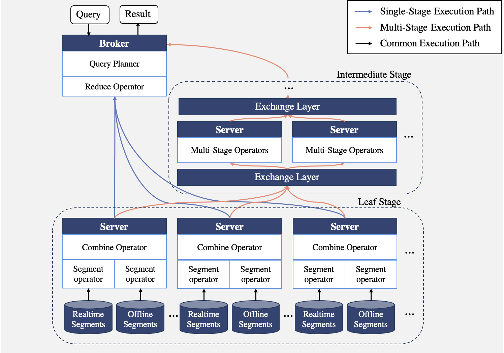

# Apache Pinot Query Engine Optimizations at StarTree

## Introduction

The Apache Pinot project, originally developed at LinkedIn, is a distributed real-time OLAP database system that is designed to provide ultra low-latency analytics at extremely high throughput, with an emphasis on data freshness. 

During summer 2025, my project at StarTree, Inc. focused on query engine optimizations for Apache Pinot. The project touched multiple components within the query engine. This repo serves as a summarization of most works I've done during the summer.

*Figure 1: Apache Pinot query engine architecture*

My major responsibility includes:
- Working on the Apache Pinot Project, optimizing the execution engine for reduced query latency, increased throughput, and reduced memory usage. 
- Shipping new features for the new Multi-Stage Execution Query Engine.
- Identifying and hot-fixing system inefficiencies  

My major outcomes includes: 
- Reducing query execution latency involving Group-By and Sort execution by more than 40%, respectively. Speeding up Group-By Combine component execution by over 30 times.
- Reducing intermediate result size and reduce allocation by above 30% in Join, Sort, Group-By, and Dictionary-Encoded Scan execution.
- Supporting run-time adjustment of query planner rules via query options. Introduce planner rule management conventions. Supplying additional heuristic rules for query optimization.

## Table of Content

- Single-Stage Query Engine Group-By Execution Enhancements
[link](src/sse-groupby.md)
- Multi-Stage Query Engine Join Execution Enhancements 
[link](src/mse-join.md)
- Query Planner / Optimizer Enhancements
[link](src/query-planner.md)
