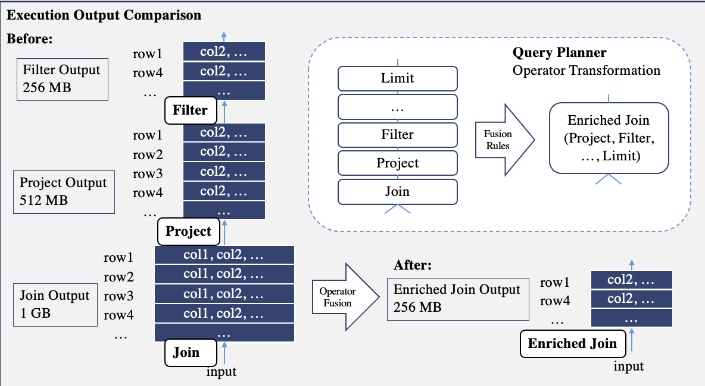

# MSE Join Execution Enhancement

Pinot's Multi-Stage Execution Engine uses a fully-in-memory on-heap row-oriented storage model for execution. With 
Java's GC mechanisms, this makes optimizing for reduced intermediate result allocations crucial for query performance. 
Several enhancements were made towards this goal.

## Operator Fusion - Enriched Join Operator

### Background

Along with the fully-in-memory row-store model, Pinot uses a pull-based vectorized execution model. 
This means (for each stage) the root operator calls `getNextBlock()` on its child operators, 
who then recursively calls `getNextBlock()` on ITS children, gets **blocks** of tuples, performs the processing logic, 
and then returns **blocks** of tuples to its parent. Since everything is early-materialized, an output block of an 
operator needs to be kept on-heap before the parent operator finish processing them. If the block is large / wide, 
this could build up to large mem and GC pressure.

An optimization we could do is to **fuse** operators together. Doing so has two major benefits:

Firstly, this avoids materializing any intermediate outputs for the fused operators. For example, if the output block of a join
is 10MB, a following projection narrows the rows and produces a block of 5MB, a following filter trims and produces a block of 2MB; 
then if these operators are fused together, we save ~15MB mem usage by avoiding materialization of the join and projection outputs.

Secondly, this reduces the number of `getNextBlock()` calls, which could lead to deep recursion stacks when the operator chain is long.
By fusing operators together, we can potentially reduce function call overhead, avoid frequent data movement in and out of CPU registers, 
reduce cache thrashing, and benefit from JIT compilations. The idea is, we process the same chunk of data for as long as we can 
before we move on to the next one. In our context, compared to the first benefit, this one is relatively minor.

In practice, most systems that do operator fusion with code-gen use a push-based execution model, which often features a central 
scheduler that facilitates this process at run-time. While this isn't available in Pinot, what we could do is to write templates and 
specialize for common cases first, and trigger operator fusion during query planning.

### Implementation

The **Enriched Join** operator specializes for cases where we have **arbitrary combinations** of projections and filters plus an optional limit above
a join (currently HashJoin only). The implementation is staight-forward: the operator uses a list to keep all fused-in filters and projections 
operations in-order, then apply them sequentially over the input block on a per-row bases. If there is a limit fused in, it is applied at the end. 
In this way, the output block of the Enriched Join operator doesn't contain any row to be discarded or any column to be projected away.

### Benchmarking

The effectiveness of this fusion depends on the selectivity of the filter predicate and the extent to which the projection shrinks the 
columns width. Allocation profiling on an example query could be found [here](https://github.com/apache/pinot/pull/16123).

## Non-EquiJoin Predicate Early Evaluation

Another optimization we could do is to evaluate predicates over joins without having to materialize the join output. A simple optimization was made 
for Non-EquiJoin operator that directly evaluates the non-equi predicate over the left and right input of the join. This is implemented using a "view" 
over the inputs.

Again, its effectiveness depends on the selectivity of the filter predicate. The higher the selectivity, the more rows we avoid to materialize. 
A benchmarking example could be seen [here](https://github.com/apache/pinot/pull/16152)

## Sort-Merge Join

A prototype of Sort-Merge Join operator was implemented [here](https://github.com/apache/pinot/pull/16213). Conceptually, this is useful when the inputs are 
sorted on a superset of join keys or the desired output requires sort on a subset of the join keys. However we do not have the infrastructure for sort collation 
information between operators yet, so this project in not proceeded.

